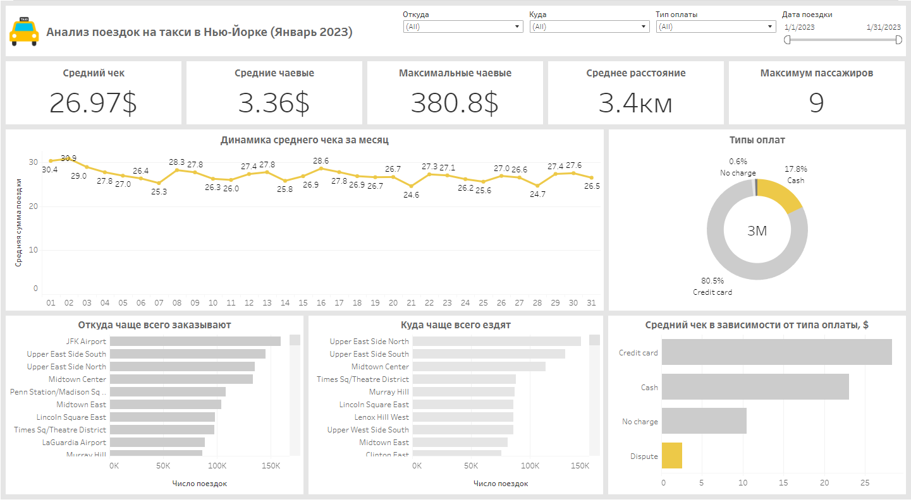

# Анализ поездок на такси в Нью-Йорке (Январь 2023)

Целью проекта яввляется проведение разведочного анализа данных с помощью Python, ответы на некоторые вопросы, которые можно было бы задать к этому набору данных, выводы исходя из полученных результатов и построение визуализвции данных в Tableau.

---

## Данные

Можно скачать данные и найти полное описание полей датасета по [ссылке](https://www.nyc.gov/site/tlc/about/tlc-trip-record-data.page).

Комиссия по такси и лимузинам города Нью-Йорка (TLC), созданная в 1971 году, является агентством, ответственным за лицензирование и регулирование деятельности такси Нью-Йорка желтых автомобилей, сдаваемых в аренду. Совет Комиссии состоит из девяти членов, восемь из которых являются членами Комиссии, не получающими зарплату. Наемный председатель/комиссар председательствует на регулярных заседаниях общественной комиссии и является главой агентства, штат которого насчитывает около 600 сотрудников TLC.

Записи о поездках на желтых и зеленых такси включают поля, в которых указаны даты/время посадки и высадки, места посадки и высадки, расстояния поездки, подробные тарифы, типы тарифов, типы оплаты и количество пассажиров, сообщаемые водителем. Данные, использованные в прилагаемых наборах данных, были собраны и предоставлены Комиссии по такси и лимузинам Нью-Йорка (TLC) поставщиками технологий, авторизованными в рамках программ повышения качества обслуживания пассажиров такси. Данные о поездках не были созданы компанией TLC, и компания TLC не делает никаких заявлений относительно точности этих данных.

## Разведочный анализ

Была произведена предобработка датасета, некоторые пропущенные значения и потенциальные ошибки были исключены, некоторые поля преобразованны для удобства. После этого был дан ответ на ряд вопросов:
* Как распределяется число пассажиров / заказов в рамках одного дня / месяца
* Какие самые популярные способы оплаты
* Как зависит цена от способа оплаты
* В какое время самые дорогие поездки
* В какие самые популярные места ездят люди и откуда уезжают чаще всего

Ответы на вопросы и некоторые выводы по данным можно посмотреть в [блокноте](eda/taxi_eda.ipynb).

## Визуализация
 Дашборд доступен по [ссылке](https://public.tableau.com/views/NYCtaxidashboard/Dashboard1?:language=en-US&:sid=&:display_count=n&:origin=viz_share_link).

 Визуализация была сделана в Tableau. При визуадизации хотелось показать динамику за месяц, а также некоторые важные срезы исходя из поставленных ранее вопросов, помимо этого на дашборд были добавлены несколько KPI, которые также могут показаться информативными и интересныыми. На дашборде есть фильтры, чтобы посмотреть любую интересующую информацию в любом разрезе.

 

 
